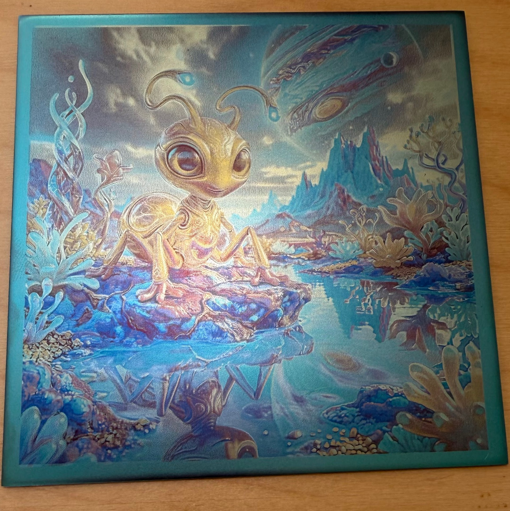
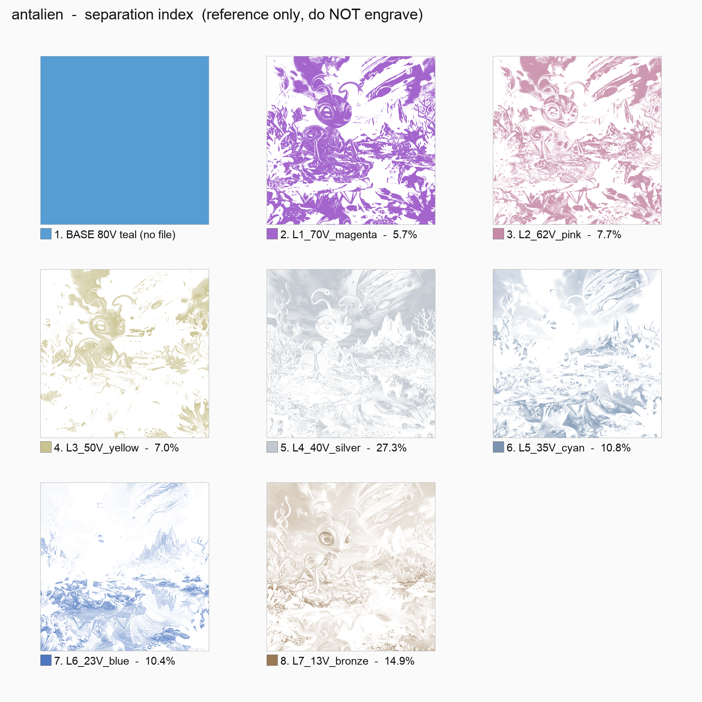
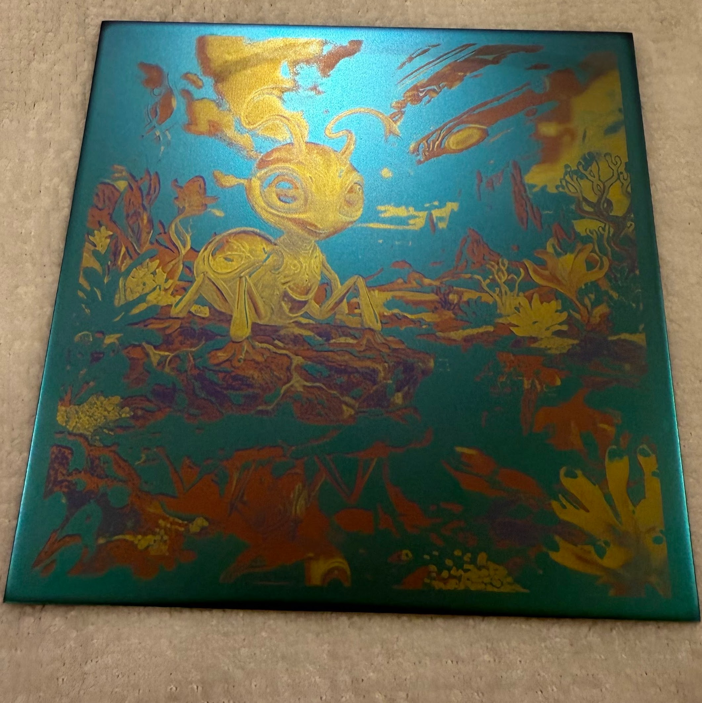
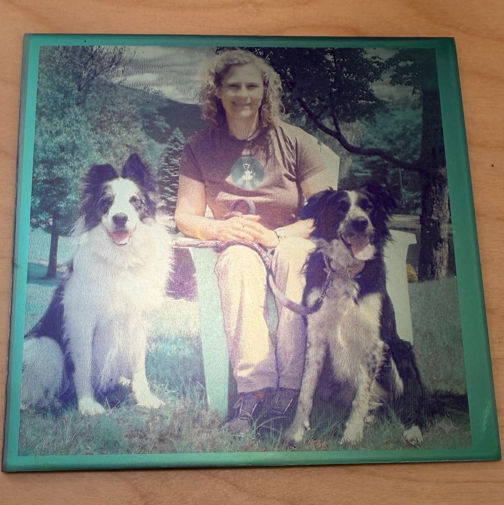

<!--
  DRAFT README — structure/layout focused. Replace bracketed [placeholder] text
  and swap in real images under /gallery/hero/. Sections marked (OPTIONAL) can
  be cut if they end up redundant with docs/ pages.
-->

<div align="center">

# [Project / Series Name]
### Photographic mosaics, anodized onto titanium — one color at a time
Repeated anodize → laser-ablate → re-anodize cycles on titanium sheets can produce full color 508 DPI images.  The process involves image processing, metal preparation, and repeated "dunks" in a carefully-controlled trisodium phosphate solution with a direct current voltage between 15 and 105 volts.

[](#) 
[](#license) 
[](#)

</div>

---

## Gallery preview

<table>
  <tr>
    <td width="33%">
      
      <p align="center"><sub><b>Finished piece (actual size 100 mm x 100 mm)</b><br>[AI generated to fit Ti palette, 508 DPI]</sub></p>
    </td>
    <td width="33%">
      
      <p align="center"><sub><b>Derived from the original image by ti_mosaic_separator.py</b><br>[508 DPI preview]</sub></p>
    </td>
    <td width="33%">
      
      <p align="center"><sub><b>After teal, magenta, pink, and yellow (gold) anodize dunks</b><br>[ready for ablating silver]</sub></p>
    </td>
  </tr>
  <tr>
    <td width="33%">
      <video src="https://github.com/user-attachments/assets/4446cb57-93af-415b-9d44-26bceccfb9a3" controls width="100%"></video>  
    </td>
    <td width="33%">
      <b>Video to show the cool way the anodized pieces shimmer.  It's very hard to record and show this on the screen, and the shimmer is one of the most appealing aspects of the technique.</b><p>The way anodized titanium makes the appearance of colors is through interference of different wavelengths of light refracting and reflecting through the TiO2 layer created by the anodizing.  The voltage controls the thickness of the layer which in turns controls perceived color.  The shimmery effect is what makes the pieces magical for me.</p>
    </td>
    <td width="33%">
      
      <p align="center"><sub><b>Finished piece (actual size 100 mm x 100 mm)</b><br>[Photo with colors adjusted by AI to fit colors available anodizing Titanium, 508 DPI]</sub></p>
    </td>
  </tr>
</table>

---

## What this is

I am an engineer and woodworker who now makes full-color, photorealistic images on titanium sheets by anodizing,
laser-ablating a mask of one color, re-anodizing at a lower voltage, and
repeating — up to nine times per piece. A Python script
(`ti_mosaic_separator.py`) turns a source photo into a stack of 1-bit masks that when ablated and anodized in the proper order produce a color mosaic blending the colors into a color image.  These pieces may look like they were produced by a machine, but they are genuinely handmade.  Each requires meticulous surface preparation, multiple laser passes, and multiple separate trips to the TSP
electrolyte bath in a sophisticated hand-built anodizing rig. It's a wonderful blend of digital preparation and analog rendering and depending on how many colors are involved can take several hours to complete.   

## How it works (short version)
1. Decompose the source image into per-color masks (script does this).
2. Anodize the whole sheet to the highest-voltage color — this becomes the base.
4. Laser-ablate the next color's mask; re-anodize at the next-lower voltage to add that color.
5. Repeat, descending in voltage, until all colors are laid down in a very precise 508 DPI mosaic.
6. Final pass produces a photorealistic image built from three to nine discrete anodized colors.

For lots more details, please see the Wiki.

## Why this is different

[Short prior-art paragraph — you found ~4 other multicolor-anodizing approaches.
Name them briefly, then state your specific claim precisely rather than "first
ever." Example seed:]

Other multicolor titanium anodizing approaches I've found: electrified-solution
pen-plotting, dabbing solution by hand, mask-then-dunk-then-remask, and
direct laser coloring. As far as I've been able to determine, combining
**full RGB image decomposition into per-voltage ablation masks with repeated
anodize/ablate cycling** to get photorealistic results at 508 DPI is
undocumented elsewhere. See [`docs/prior-art.md`](docs/prior-art.md) for details
and if you know of prior work I've missed, please open a
[discussion](../../discussions) — genuinely want to know.

## The struggle (it's not as clean as it looks)

[This section directly answers the "looks machine-made" concern — keep it
honest and specific, not just "it was hard." Example seed:]

These look precise because they *are* precise — but precise took [months] of
figuring out, one variable at a time: DPI/pixel-mapping bugs, a palette that
looked right in preview and came out muddy on metal, shadow tuning that
turned out to work backwards from instinct depending on the source image, and
plenty of runs that just didn't work.

See [`docs/lessons-learned.md`](docs/lessons-learned.md) for the dated,
warts-and-all version, and [`gallery/failures/`](gallery/failures/) for the
proofs that didn't make it.

## Repo structure

```
.
├── ti_mosaic_separator.py     # the decomposition pipeline
├── docs/
│   ├── process.md             # physical steps: bath, laser, safety
│   ├── pipeline.md            # how the script works, parameters
│   ├── palette.md             # voltage/color table + how it was derived
│   ├── prior-art.md           # other approaches + how this differs
│   └── lessons-learned.md     # the journey, dated
├── gallery/
│   ├── index/                 # thumbnails of all images
│   ├── <piece-name>/          # source, proof, masks, process photos, final
│   └── failures/              # what didn't work, and why
├── LICENSE                    # code license (MIT)
├── LICENSE-ART.md             # separate license for images/art
└── CONTRIBUTING.md
```

## Try it yourself

[Minimal quickstart — keep short, link out for detail.]

```bash
python ti_mosaic_separator.py --input source.jpg --width-mm 94
```

Full usage, parameters, and palette calibration →
[`docs/pipeline.md`](docs/pipeline.md)

## Collaborate / get in touch

[Invite line — you specifically want to find others doing this or adjacent
work. Example seed:]

If you're doing anything in this space — pen-plotter anodizing, mask-and-dunk,
laser-direct color, or your own version of this — I'd love to hear about it
and compare notes. Open a [discussion](../../discussions) or an issue.

Finished pieces are available on [Etsy → \[shop link\]](#).
[Optional: art-show / exhibit note, e.g. "Currently showing at \[venue\]."]

## License

- **Code** (`ti_mosaic_separator.py` and related scripts): [MIT](LICENSE)
- **Images and art**: see [`LICENSE-ART.md`](LICENSE-ART.md) — [placeholder,
  e.g. CC BY-NC 4.0; not for commercial reproduction]

---

<div align="center"><sub>[optional footer, e.g. "Built and anodized by [name] — [location/workplace note if desired]"]</sub></div>

## Gallery

<!-- GALLERY:START (auto-generated by scripts/manage_gallery.py -- do not hand-edit this block) -->

<table>
  <tr>
    <td width="33%" align="center">
      <br>
      <sub><b>Woman And Dogs</b></sub>
      <br><sub><a href="gallery/woman_and_dogs/_index.png">index sheet</a></sub>
    </td>
    <td width="33%" align="center">
      <br>
      <sub><b>Woman And Dogs Sav</b></sub>
    </td>
  </tr>
</table>

<!-- GALLERY:END -->
