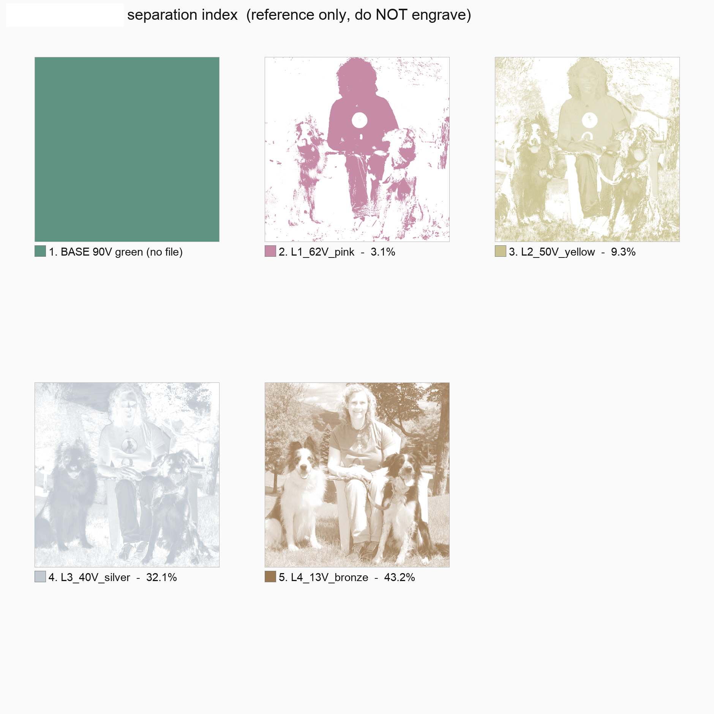

# Gallery

Every piece below is shown with its finished photo next to the index sheet from that run -- the actual map of anodized layers that produced it. Nothing here is printed or filtered onto the metal: each color is its own anodize / laser-ablate / re-anodize cycle on titanium.

<!-- GALLERY:START (auto-generated by scripts/manage_gallery.py -- do not hand-edit this block) -->

### Alien

<table>
  <tr>
    <td width="50%" align="center">
      
       Finished piece
    </td>
    <td width="50%" align="center">
      
       Index sheet -- every anodized layer that went into this piece
    </td>
  </tr>
</table>

---

### Woman And Dogs

<table>
  <tr>
    <td width="50%" align="center">
      
       Finished piece
    </td>
    <td width="50%" align="center">
      
       Index sheet -- every anodized layer that went into this piece
    </td>
  </tr>
</table>

<!-- GALLERY:END -->
